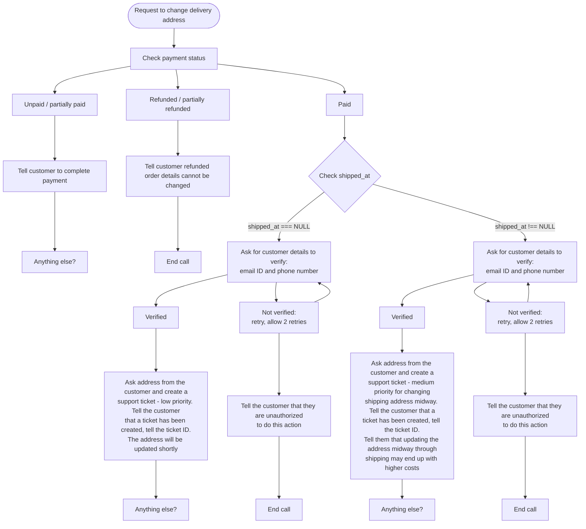
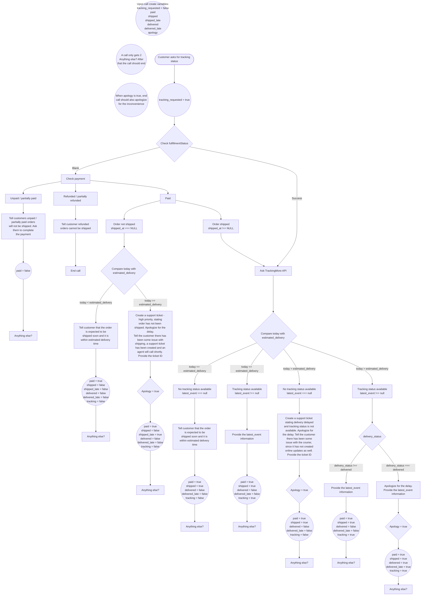
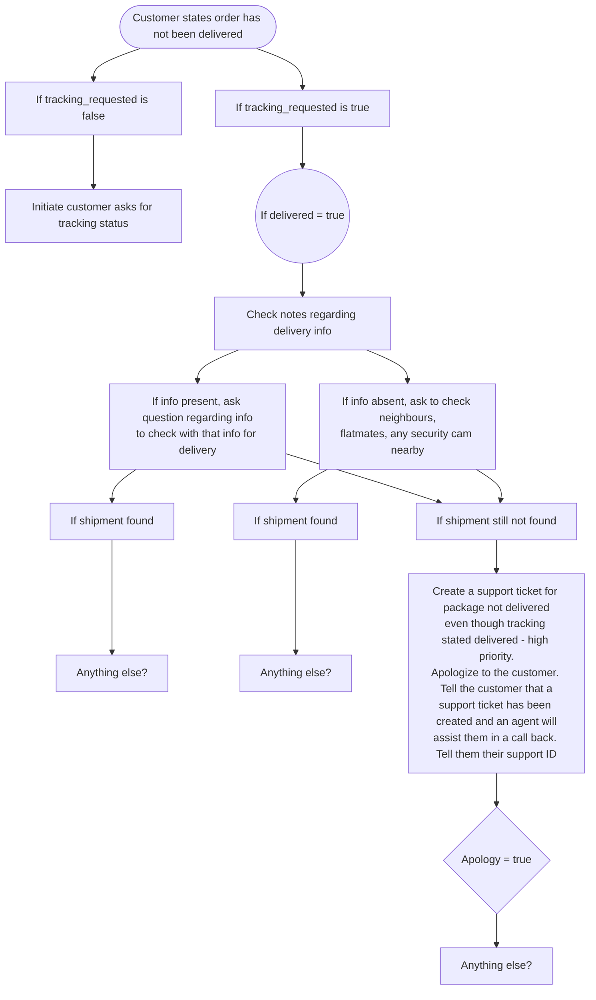
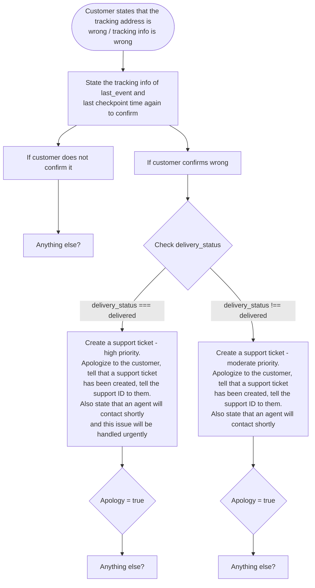

# Customer Support Conversation Flows

Source: `Drawing 2026-06-22 12.33.25.excalidraw.png`

## Request to change delivery address

<!-- Recreate the payment, shipment, verification, and support-ticket branches from the drawing. -->

## Customer asks for tracking status

<!-- Recreate the tracking flow and its state-variable updates from the drawing. -->

## Customer states order has not been delivered

<!-- Recreate the tracking-requested and shipment-search branches from the drawing. -->

## Customer states tracking address or tracking info is wrong

<!-- Recreate the confirmation and priority branches from the drawing. -->

