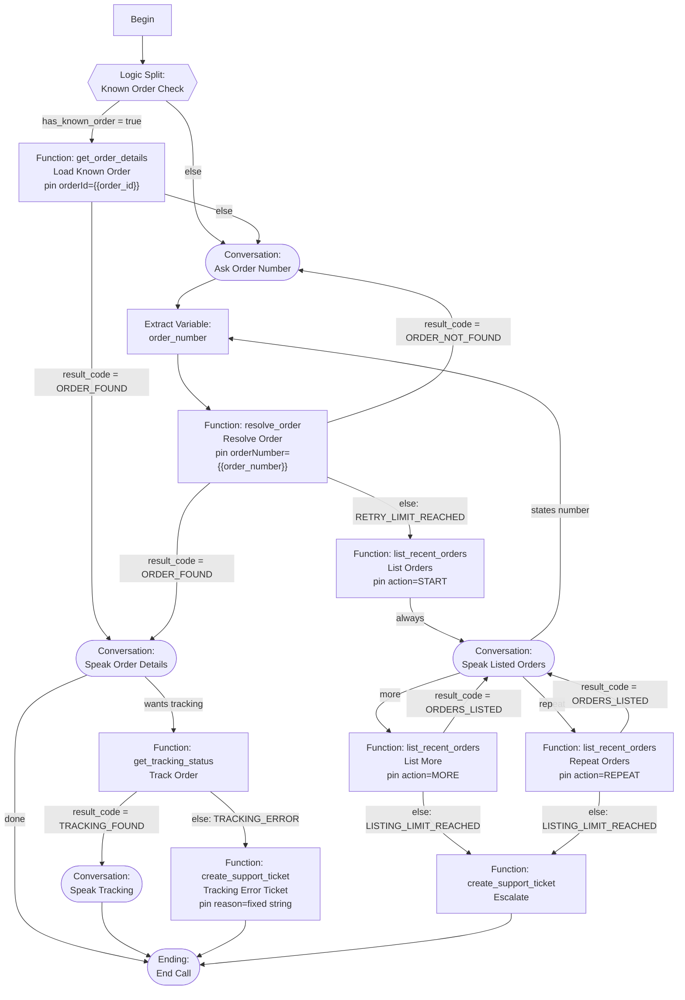

# Retell Conversation Flow Setup

## Direct answers

- Do not publish an empty agent or flow. Build and test the minimum node graph below first.
- There is no "Enable Web Call" switch on the agent. Web Call begins when this app calls Retell's `POST /v2/create-web-call`; frontend then joins using returned access token.
- `agent_id` identifies Retell agent, not Conversation Flow. Open agent in Retell dashboard and copy Agent ID shown in agent details. If current dashboard hides it, copy ID from agent page URL or call Retell List Agents API. Store value in `.env` as `RETELL_AGENT_ID`.
- Conversation Flow and Agent are separate resources. Build flow first, then create/edit agent and select that flow as agent's response engine.

## Before Retell setup

Retell calls the **Express API** (`apps/api`, default port `3001`), not the Next.js frontend. Retell cannot call `localhost`. Start the API, expose it through an HTTPS tunnel, then use the tunnel base URL below as `PUBLIC_APP_URL`. The API mounts these endpoints without an `/api` prefix (e.g. `/retell/functions/resolve-order`, `/retell/webhook`).

Example: `https://your-tunnel.example.com`

Required `.env` values:

- `RETELL_API_KEY`: Retell dashboard API key.
- `RETELL_AGENT_ID`: agent ID copied after agent is created.
- `RETELL_FUNCTION_SECRET`: same secret configured as custom header on every Retell function.
- `TRACKINGMORE_API_KEY`: real TrackingMore API key.

## 1. Create Conversation Flow

In Retell dashboard:

1. Open Conversation Flows and create blank flow named `WISMO Customer Flow`.
2. Open Global Settings.
3. Set language/voice defaults.
4. Add global prompt:

> You are an ecommerce order-status assistant. Help only with orders owned by authenticated customer context supplied by backend. Never invent order or tracking data. Keep responses brief and suitable for speech. Follow node transitions and backend result codes exactly. When backend returns an error or escalation result, do not work around it.

5. Add nodes from next section.
6. Test both known-order and general-order paths.
7. Publish flow only after all required transitions work.

## 2. Build the node graph

Retell's flow builder gives you a fixed node palette (Conversation, Function, Logic Split, Extract Variable, Ending, etc — left sidebar). A custom function maps to **one reusable Function node** per function created in the dashboard; its own `+Transition`/`Else` rows branch directly on the function's response fields — no separate node needed for that part. Where the doc's logical graph needs the *same* function called with different fixed arguments (e.g. `list_recent_orders` with `action: "START"` vs `"MORE"` vs `"REPEAT"`), **duplicate that Function node on the canvas** and pin a different literal value into its parameter per instance — this matches **Rigid Mode** transition flexibility (recommended over letting the LLM pick the enum live).

Each Function node's Transition condition box is **free text**, not a variable picker — type `{{variable_name}}` literally (e.g. `{{result_code}} = "ORDER_FOUND"`). But a response field only becomes available as `{{variable_name}}` once it's registered on the **custom function definition itself**, under "Store Fields as Variables" (see §2b) — there is no separate per-node Extract Variable step for response fields. The dedicated **Extract Variable** node type is reserved for things with no backend field to map, like capturing the order number the customer just spoke out loud.

| # | Node type (palette) | Label | What goes in it |
| --- | --- | --- | --- |
| 1 | *(built-in)* | `Begin` | already present |
| 2 | Logic Split | `Known Order Check` | Transition: `{{has_known_order}} = "true"` → 4. Else → 3 |
| 3 | Conversation | `Ask Order Number` | Prompt: "Greet the customer, ask for their order number." Transition: always → 5 |
| 4 | Function (`get_order_details`) | `Load Known Order` | Pin `orderId` = `{{order_id}}` (dynamic variable Retell already receives from `/retell/web-call`, per `apps/api/src/routes/retell.ts:37-43`). Transition: `{{result_code}} = "ORDER_FOUND"` → 8. Else → 3 |
| 5 | Extract Variable | `Capture Order Number` | New variable `order_number` — instruction: "the order number the customer just said, normalized." Transition: always → 6 |
| 6 | Function (`resolve_order`) | `Resolve Order` | Pin `orderNumber` = `{{order_number}}`. Transitions: `{{result_code}} = "ORDER_FOUND"` → 8; `{{result_code}} = "ORDER_NOT_FOUND"` → 3 (loop back); Else (`RETRY_LIMIT_REACHED`) → 9 |
| 8 | Conversation | `Speak Order Details` | Prompt: "Speak items, carrier, notes, estimated delivery from the last function result. Ask if they want live tracking." Transitions: "wants tracking" → 11; "done" → 16 |
| 9 | Function (`list_recent_orders`) | `List Orders` | Pin `action` = `"START"`. Transition: always → 10 (only one outcome, `ORDERS_LISTED`, on a fresh `START`) |
| 9b | *(duplicate of 9)* | `List More` | Pin `action` = `"MORE"`. Transitions: `{{result_code}} = "ORDERS_LISTED"` → 10; Else (`LISTING_LIMIT_REACHED`) → 14 |
| 9c | *(duplicate of 9)* | `Repeat Orders` | Pin `action` = `"REPEAT"`. Transitions: `{{result_code}} = "ORDERS_LISTED"` → 10; Else (`LISTING_LIMIT_REACHED`) → 14 |
| 10 | Conversation | `Speak Listed Orders` | Prompt: "Speak each order number/date/amount/currency from the result. Ask: state an order number, more, or repeat." Transitions by intent: states number → 5; "more" → 9b; "repeat" → 9c |
| 11 | Function (`get_tracking_status`) | `Track Order` | No pinned params — backend falls back to the call's already-resolved order server-side (`apps/api/src/lib/wismo.ts:111-114`). Transitions: `{{result_code}} = "TRACKING_FOUND"` → 12. Else (`TRACKING_ERROR`) → 13 |
| 12 | Conversation | `Speak Tracking` | Prompt: "Speak every shipment's status/event/date/location, then notes." Transition: always → 16 |
| 13 | Function (`create_support_ticket`) | `Tracking Error Ticket` | Pin `reason` = `"Tracking provider unavailable"`. Transition: always → 16 |
| 14 | *(duplicate of 13)* | `Escalate` | Leave `reason` unpinned, or pin a generic string like `"Listing limit reached"`. Transition: always → 16 |
| 16 | Ending | `End Call` | terminal |

Node 4/6's success transition routes **directly** to node 8 — no intermediate "capture order id" step needed, because `get_order_details`/`resolve_order`'s own "Store Fields as Variables" mapping (§2b) already overwrites `{{order_id}}` with the resolved order's database id as a side effect of the call.

Backend persists three **independent** counters behind these transitions — `invalidOrderAttempts` (wrong/unrecognized order number, cap 2), `listingRepeatCount` (`REPEAT` action, cap 2), `moreOffenseCount` (`MORE` past the end of the list, cap 2). Never share one budget across them in the flow design, and never invent a fourth counter for off-topic questions — the global prompt is the only guard against those, the backend has no code path for it.

### 2a. Store Fields as Variables (per function)

Every custom function's edit dialog has a "Store Fields as Variables" section (below "Parameters", above "Test") — left column is the variable name you choose, right column is the JSON path into that function's response body. Without this, `{{result_code}}` etc used in §2's transitions above won't resolve to anything. Configure each function once:

| Custom function | Variable name | Response path | Why |
| --- | --- | --- | --- |
| `get_order_details` | `result_code` | `code` | branch on §2 node 4 |
| `get_order_details` | `order_id` | `id` | overwrites the call's known order id, only present when `code = "ORDER_FOUND"` |
| `resolve_order` | `result_code` | `code` | branch on §2 node 6 |
| `resolve_order` | `order_id` | `id` | same as above, set on first successful resolution |
| `get_tracking_status` | `result_code` | `code` | branch on §2 node 11 |
| `list_recent_orders` | `result_code` | `code` | branch on §2 nodes 9b/9c (node 9's first-ever `START` call only ever returns `ORDERS_LISTED`, so no branch needed there) |
| `create_support_ticket` | `result_code` | `code` | optional — both nodes 13/14 always transition to `End Call` regardless, since `create_support_ticket` only ever returns `TICKET_CREATED` (`apps/api/src/lib/wismo.ts:160-172`) |

Map `order_id` to the same variable name on both `get_order_details` and `resolve_order` — both represent "the order the conversation is currently about," and whichever function resolves it last should be the value subsequent calls (like `get_tracking_status`) implicitly rely on server-side.

> **Source of truth is now `apps/api/conversation-flow.json`, pushed by `scripts/push-conversation-flow.ts`.** The mappings above are encoded in each tool's `response_variables` block, so you no longer hand-enter them in the dashboard — editing the JSON and re-running the push script is the workflow. The expanded flow (4 entry points) adds these backend-computed branch flags, all set the same way:
>
> | Functions | Variables (response path = same name) | Used by |
> | --- | --- | --- |
> | `resolve_order`, `get_order_details` | `paid`, `fulfilled`, `shipped`, `overdue`, `shipped_late`, `has_notes` | payment/shipped/ETA gating before any tracking call |
> | `get_tracking_status` | `delivered`, `delivered_late`, `has_tracking`, `overdue`, `shipped_late`, `has_notes`, `paid`, `shipped`, `tracking_requested`, `apology`, plus speakable `last_event`, `last_checkpoint`, `delivery_date`, `eta`, `notes` | every tracking branch + the "not delivered" intent reusing them with no second lookup |
> | `verify_identity` | `result_code` (`VERIFIED` / `NOT_VERIFIED`) | address-change email verification (2 structural retries) |
> | every `create_*_ticket` | `result_code`, `ticket_id`, `apology` | speak the ticket id; `apology` drives the End Call apology |
>
> Booleans arrive as `"true"`/`"false"` strings, so transitions compare `{{paid}} = "true"` etc. `tracking_requested`/`apology`/counters are seeded to defaults per call in `apps/api/src/routes/retell.ts` so a recycled agent never inherits a prior call's state.

### 2b. Node graph diagram

## 3. Create five custom functions

For every custom function:

- Method: `POST`.
- Header: `x-retell-function-secret` = exact `.env` `RETELL_FUNCTION_SECRET` value.
- Leave `Payload: args only` disabled. Full payload includes `call.call_id`, needed to load backend call state.
- Use public HTTPS tunnel URL, never localhost.

For every custom function below, the API expects five functions. `get_order_details` and `resolve_order` are free — DB-only, no TrackingMore call. `get_tracking_status` is the only function that costs a TrackingMore API call; wire it only behind explicit "where is my order" intent, not into the initial order-load path.

Create each function **once** in the dashboard, then reuse it across multiple Function nodes in the flow graph with a different fixed argument per node — this is why §2's graph has 8 Function nodes but only 5 functions exist:

| Function node(s) in §2 | Custom function | Fixed arg per node |
| --- | --- | --- |
| `Load Known Order` | `get_order_details` | — |
| `Resolve Order` | `resolve_order` | — |
| `Track Order` | `get_tracking_status` | — |
| `List Orders` | `list_recent_orders` | `action: "START"` |
| `List More` | `list_recent_orders` | `action: "MORE"` |
| `Repeat Orders` | `list_recent_orders` | `action: "REPEAT"` |
| `Escalate` | `create_support_ticket` | `reason` = whatever triggered escalation |
| `Tracking Error Ticket` | `create_support_ticket` | `reason: "Tracking provider unavailable"` |

| Function | URL | Parameter schema |
| --- | --- | --- |
| `resolve_order` | `PUBLIC_APP_URL/retell/functions/resolve-order` | Required string `orderNumber` |
| `get_order_details` | `PUBLIC_APP_URL/retell/functions/get-order-details` | Optional string `orderId` |
| `get_tracking_status` | `PUBLIC_APP_URL/retell/functions/get-tracking-status` | Optional string `orderId` |
| `list_recent_orders` | `PUBLIC_APP_URL/retell/functions/list-recent-orders` | Required enum string `action`: `START`, `MORE`, `REPEAT` |
| `create_support_ticket` | `PUBLIC_APP_URL/retell/functions/create-support-ticket` | Required string `reason` |

Retell sends full function envelope containing `name`, `call`, and `args`. Backend reads call ID from `call.call_id` and function fields from `args`.

`resolve_order` and `get_order_details` both return `code: "ORDER_FOUND"` plus the exact same order record `GET /customer/orders/:orderId` returns (`orderNumber`, `numItems`, `orderTotal`, `currency`, `shippingCarrier`, `trackingNumber`, `trackingUrl`, `shippedAt`, `estimatedDelivery`, `notes`, `lineItems[]`, etc.) — one shared shape across web and voice, zero TrackingMore cost. They do **not** include live tracking status.

`get_tracking_status` returns `isSplitShipment`, `shipments` (same parcels, now with live status), customer-safe `notes`, and a backwards-compatible first `tracking` result. When `isSplitShipment` is true, speak every shipment in `shipments`; line-item tracking is authoritative. When false, the single shipment comes from required order-level tracking fields. Never infer split shipment by reading notes.

## 4. Create and publish Agent

1. Open Agents and create agent named `WISMO Web Agent`.
2. Choose Conversation Flow as response engine.
3. Select published `WISMO Customer Flow`.
4. Configure voice, language, interruption sensitivity, and agent webhook.
5. Set webhook URL to `PUBLIC_APP_URL/retell/webhook`.
6. Add webhook header `x-retell-function-secret` with same local secret if dashboard supports webhook headers. Otherwise webhook signature verification must be implemented before enabling webhook.
7. Save/publish agent.
8. Copy Agent ID into `.env` as `RETELL_AGENT_ID`.
9. Copy Retell API key into `.env` as `RETELL_API_KEY`.

Do not buy or attach phone number. Agent can be used by Web Call API without phone number.

## 5. How Web Call works in this app

1. Customer clicks voice button.
2. Browser calls the API endpoint `POST {NEXT_PUBLIC_API_URL}/retell/web-call` with its `Authorization: Bearer` token.
3. API calls Retell `POST /v2/create-web-call` using `RETELL_AGENT_ID` and secret API key.
4. Retell returns access token valid for short time.
5. Browser Retell SDK starts call using access token.

Therefore Web Call is enabled by API integration, not dashboard toggle.

## 6. Test before production use

1. Order-specific call: open `#BB1042`, launch call, confirm no order-number question.
2. General call: launch from orders page, say valid order number, confirm tracking lookup.
3. Say invalid order twice, confirm last five orders are listed.
4. Request list repeat three times, confirm support ticket created after allowed two repeats.
5. Stop TrackingMore access, confirm agent does not invent status and creates ticket.
6. Check admin dashboard for call, tracking error, and ticket records.

## Static knowledge base

Suitable: opening hours, support channels, shipping policy, refund policy, escalation expectations.

Never store customer records, orders, tracking numbers, shipment status, call counters, or ticket state in Retell Knowledge Base. Those values come from backend custom functions.

## Official references

- [Conversation Flow overview](https://docs.retellai.com/build/conversation-flow/overview)
- [Custom functions](https://docs.retellai.com/build/conversation-flow/custom-function)
- [Web Call SDK](https://docs.retellai.com/deploy/web-call)
- [Create Web Call API](https://docs.retellai.com/api-references/create-web-call)
